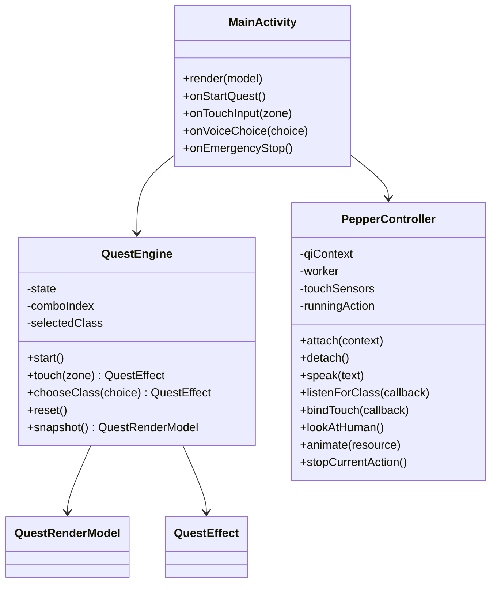

# Class diagram

```mermaid
classDiagram
  class MainActivity {
    +render(model)
    +onStartQuest()
    +onTouchInput(zone)
    +onVoiceChoice(choice)
    +onEmergencyStop()
  }
  class QuestEngine {
    -state
    -comboIndex
    -selectedClass
    +start()
    +touch(zone) QuestEffect
    +chooseClass(choice) QuestEffect
    +reset()
    +snapshot() QuestRenderModel
  }
  class PepperController {
    -qiContext
    -worker
    -touchSensors
    -runningAction
    +attach(context)
    +detach()
    +speak(text)
    +listenForClass(callback)
    +bindTouch(callback)
    +lookAtHuman()
    +animate(resource)
    +stopCurrentAction()
  }
  class QuestRenderModel
  class QuestEffect
  MainActivity --> QuestEngine
  MainActivity --> PepperController
  QuestEngine --> QuestRenderModel
  QuestEngine --> QuestEffect
```
