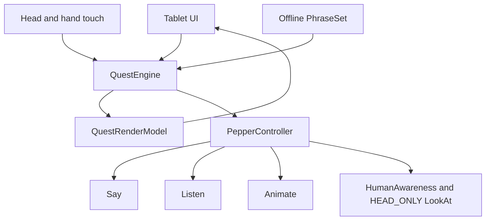

# Design

## Concept
Pepper meldt dat student mode vergrendeld is. De bezoeker ontgrendelt deze in drie korte stappen: connect via start, voer een touch-combo uit, kies een tech-class met de stem. Daarna toont Pepper een persoonlijke class-uitkomst, noemt SIT en viert met een veilige dans.

## Architectuur
`MainActivity` rendert de tabletinterface en bezit één `QuestEngine`. `PepperController` is de dunne QiSDK-adapter voor speech, listen, touch, LookAt en animaties. UI-events en fysieke sensoren worden vertaald naar dezelfde domeinevents. De engine bevat geen Android- of QiSDK-types en is unit-testbaar.

## State
`IDLE`, `TOUCH_COMBO`, `VOICE_CLASS`, `RESULT`. Alleen de engine wijzigt queststate. Robot callbacks posten events terug naar de main thread.

## Concurrency
Eén single-thread executor bezit Say, Listen en Animate. Actieve Listen en animatiefutures zijn annuleerbaar. `stopCurrentAction()` wordt aangeroepen bij reset, focusverlies en noodstop. Sensors worden exact één keer gebonden en altijd verwijderd.

## Data
Alle state leeft in geheugen. Er is geen database, backend, bestandsschrijfactie of analytics.

## API
Er zijn geen netwerk-endpoints. De interne adapter gebruikt alleen QiSDK 1.7.5 builders en Touch sensor names.

## Fallback
Tabletknoppen sturen dezelfde touch- en voice-events als de fysieke inputs. Daardoor is de quest previewbaar en blijft de stand bruikbaar als één robotfunctie faalt.

## Requirementdekking
R001 start en reset via MainActivity. R002 touch via engine en adapter. R003 voice via PhraseSet. R004 gaze en animatie via PepperController. R005 SIT-interface via lokale resources. R006 safety via serialisatie en HEAD_ONLY. R007 fallback via tabletsimulatie. R008 APK en docs via buildrunbook. R009 SIT-feiten op resultaat. R010 korte lineaire flow. R011 begeleidersdiagnostiek via statusregel en sensorfeedback.

## Figma
Brandbron: https://www.figma.com/design/tIr6cbTBLa26HIsLkW2vyG/SIT-Brand-Kit
